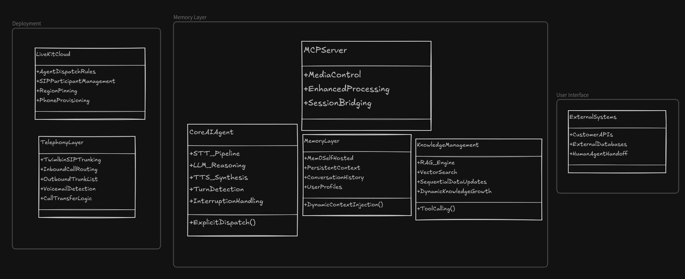

# Scope of Work (SOW): AI Calling Agent Development

## Project Overview

This Scope of Work outlines the development of an AI calling agent using the LiveKit platform with Python. The AI agent will be capable of handling both inbound and outbound telephone calls, leveraging LiveKit's telephony integration, SIP trunking (Twimlbin), agent workflows, and Retrieval-Augmented Generation (RAG) capabilities for enhanced customer support interactions. The system will utilize Mem0 self-hosted as a memory layer for persistent context storage and dynamic knowledge growth.

## Objectives

The primary objective is to develop a production-ready AI calling agent named "Customer Support" that can:
1. Handle inbound customer service calls automatically
2. Place outbound calls for customer outreach and surveys
3. Utilize custom knowledge bases through RAG for accurate responses
4. Provide seamless call transfer capabilities to human agents when needed
5. To Maintain conversation context and handle interruptions naturally

## Scope of Work

### 1. LiveKit Infrastructure Setup
- Configure LiveKit Cloud environment for agent deployment
- Set up SIP trunking using Twimlbin for telephony integration
- Configure inbound calls using Twimlbin and outbound trunks for call handling
- Establish phone number provisioning through LiveKit Phone Numbers
- Implement secure trunking with region pinning as required
- Configure MCP server of LiveKit for enhanced media control

### 2. Core Agent Development
- Develop a Python-based AI agent using LiveKit Agents SDK
- Implement STT-LLM-TTS pipeline for voice processing
- Create agent session management with explicit dispatch
- Design multimodal capabilities for speech and text processing
- Implement turn detection and interruption handling for natural conversation flow
- Integrate Mem0 self-hosted solution as memory layer for persistent context storage
- Implement dynamic knowledge base growth through sequential RAG data updates

### 3. Telephony Integration
- Configure inbound call handling with dispatch rules using Twimlbin
- Implement outbound call placement via SIP participant creation with trunk list configuration
- Develop voicemail detection and handling mechanisms
- Create call transfer functionality to human agents
- Utilize MCP server of LiveKit for enhanced call control and media processing

### 4. Knowledge Management System
- Integrate Retrieval-Augmented Generation (RAG) for custom knowledge base with user-specific contexts
- Implement initial context loading from user profiles
- Create dynamic context injection during conversations
- Design tool-based external data access for real-time information
- Implement verbal status updates for long-running operations
- Utilize Mem0 self-hosted solution for memory persistence and context retention
- Enable sequential RAG data updates for continuous knowledge growth

### 5. Workflow and Task Management
- Design multi-phase conversation workflows
- Implement task groups for complex multi-step operations
- Create specialized agent personas for different interaction types
- Develop handoff mechanisms between different agent capabilities
- Build error handling and fallback procedures

### 6. Deployment and Scaling
- Configure agent server lifecycle management
- Implement horizontal scaling for high call volume handling
- Set up monitoring and logging for performance tracking
- Create prewarm functions for optimized startup times
- Establish graceful shutdown procedures for maintenance

## Technical Architecture

### Agent Framework
The AI calling agent will be built using the LiveKit Agents framework with Python, which provides:
- Real-time WebRTC communication between users and agents
- Stateful agent sessions with persistent context
- Production-ready infrastructure for agent dispatch and job execution
- Extensive integrations with major AI providers (OpenAI, Google, Azure, etc.)
- Integration with Mem0 self-hosted for persistent memory management

### Telephony Components
The solution will leverage LiveKit's telephony services with Twimlbin integration:
- SIP participant management for bridging phone calls into LiveKit rooms
- Trunk configuration using Twimlbin for SIP trunking services
- Dispatch rules for routing inbound calls to appropriate agent instances via Twimlbin
- Outbound trunk setup using trunk list configuration for initiating calls programmatically
- MCP server integration for enhanced media control and processing

### Knowledge Integration
The agent will utilize RAG and external data patterns with Mem0 self-hosted:
- Vector search for retrieving relevant information from knowledge bases
- Tool definitions for accessing external APIs and databases
- Context injection mechanisms for dynamic information updates
- Memory management using Mem0 self-hosted for preserving conversation history
- Sequential RAG data updates for continuous knowledge base growth
- User-specific knowledge bases that evolve with interaction patterns

## Deliverables

1. **Functional AI Calling Agent**
   - Complete source code for the Customer Support agent
   - Configuration files for LiveKit Cloud deployment
   - Documentation for agent customization and maintenance

2. **Telephony Integration**
   - Inbound call handling with automated greeting and assistance
   - Outbound call placement with customizable scripting
   - Voicemail detection and handling procedures
   - Call transfer functionality to human operators

3. **Knowledge Base Integration**
   - RAG implementation for custom knowledge access
   - Tool definitions for external system integration
   - Context management for personalized interactions

4. **Deployment Package**
   - Docker configuration for containerized deployment
   - Scaling configuration for high availability
   - Monitoring and logging setup instructions

5. **Documentation**
   - Technical architecture documentation
   - API and configuration reference
   - Operations and maintenance guide
   - Testing and evaluation procedures

## Timeline

This project is estimated to be completed in 10-12 weeks with the following milestones:

- Week 1-2: LiveKit infrastructure setup and telephony configuration with Twimlbin integration
- Week 3-4: Core agent development with Python and Mem0 self-hosted integration
- Week 5-6: Telephony integration and call handling features with MCP server setup
- Week 7-8: Knowledge management system with RAG integration and memory layer implementation
- Week 9: Workflow design and task management implementation
- Week 10: Testing, optimization, and performance tuning
- Week 11-12: Documentation, deployment packaging, and final delivery

## Success Criteria

The project will be considered successful when:
1. The AI agent can handle inbound calls and respond appropriately to customer inquiries
2. The agent can place outbound calls and conduct scripted conversations
3. Knowledge base integration provides accurate information to callers
4. Call transfer functionality seamlessly connects customers to human agents
5. The system scales to handle expected call volumes with acceptable latency
6. All deliverables are documented and ready for production deployment

## Assumptions and Dependencies

1. Live Kit Cloud account with appropriate permissions for telephony features
2. Twimlbin account for SIP trunking services for both inbound and outbound calls
3. Access to customer knowledge base or documentation for RAG integration
4. Availability of development team with Python and AI integration experience
5. Testing phone numbers for inbound and outbound call validation
6. Server infrastructure for hosting Mem0 self-hosted memory layer
7. Access to MCP server of LiveKit for enhanced media control capabilities

## Conclusion

This Scope of Work defines a comprehensive approach to developing an AI calling agent using Live Kit's advanced telephony and agent capabilities. The resulting Customer Support agent will provide automated call handling with intelligent responses based on custom knowledge bases, while maintaining the flexibility to escalate to human agents when necessary.

